# Leetcode 每日一题

## [1462 课程表4 2023.09.12](https://leetcode.cn/problems/course-schedule-iv/description/)


最初解法：纯建图后DFS
```c++
vector<bool> checkIfPrerequisite(int numCourses, vector<vector<int>>& prerequisites, vector<vector<int>>& queries) {
    vector<vector<int>> graph(numCourses);
    for(int i = 0; i < prerequisites.size(); i++){
        int u = prerequisites[i][0];
        int v = prerequisites[i][1];
        graph[u].emplace_back(v);
    }
    vector<bool> ans;
    for(int i = 0; i < queries.size(); i++){
        int u = queries[i][0];
        int v = queries[i][1];
        vector<bool> visited(numCourses, false);
        dfs(graph, u, v, ans, visited, false);
        if(ans.size() < i+1) {ans.emplace_back(false);}
    }
    return ans;
}

void dfs(vector<vector<int>>& graph, int u, int v, vector<bool>& ans, vector<bool>& visited, bool flag){
    if(u == v) {
        ans.emplace_back(true);
        flag = true;
        return;
    }
    if(graph[u].size() == 0) {return;}
    for(int j = 0; j<graph[u].size(); j++){
        if(flag) {break;}
        int point = graph[u][j];
        if(visited[point] != true){
            visited[point] = true;
            dfs(graph, point, v, ans, visited, flag);
        }
    }
}
```

更好解法：拓扑排序+BFS/DFS

* 拓扑排序：1.有向无环图；
2.序列里的每一个点只能出现一次；
3.任何一对 u 和 v ，u 总在 v 之前（这里的两个字母分别表示的是一条线段的两个端点，u 表示起点，v 表示终点）

* DFS+拓扑排序

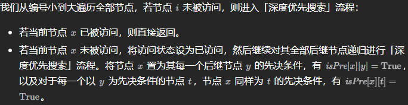
```c++
vector<bool> checkIfPrerequisite(int numCourses, vector<vector<int>>& prerequisites, vector<vector<int>>& queries) {
        vector<vector<int>> graph(numCourses);
        vector<vector<bool>> judge(numCourses, vector<bool>(numCourses, false));
        for(int i = 0; i < prerequisites.size(); i++){
            int u = prerequisites[i][0];
            int v = prerequisites[i][1];
            graph[u].emplace_back(v);
        }
        vector<bool> visited(numCourses, false);
        for(int i = 0; i < numCourses; i++){
            dfs(i, graph, judge, visited);
        }
        vector<bool> ans;
        for(int i = 0; i < queries.size(); i++){
            ans.emplace_back(judge[queries[i][0]][queries[i][1]]);
        }
        return ans;
    }

    void dfs(int cur, vector<vector<int>>& graph, vector<vector<bool>>& judge, vector<bool>& visited){
        if(visited[cur]) {return;}
        visited[cur] = true;
        for(int j = 0; j<graph[cur].size(); j++){ //遍历cur的子树
            int next = graph[cur][j];
            dfs(next, graph, judge, visited);
            judge[cur][next] = true;
            for(int nnext = 0; nnext < judge[cur].size(); nnext++){//遍历cur的子树的子树
                judge[cur][nnext] = judge[cur][nnext] | judge[next][nnext];
            }
        }
    }
```

* BFS+拓扑排序


```c++
vector<bool> checkIfPrerequisite(int numCourses, vector<vector<int>>& prerequisites, vector<vector<int>>& queries) {
    vector<vector<int>> graph(numCourses);
    vector<int> degree(numCourses, 0);
    vector<vector<bool>> judge(numCourses, vector<bool>(numCourses, false));
    for(int i = 0; i < prerequisites.size(); i++){
        int u = prerequisites[i][0];
        int v = prerequisites[i][1];
        graph[u].emplace_back(v);
        degree[v]++;
    }
    queue<int> que;
    for(int i = 0; i < numCourses; i++){
        if(degree[i] == 0){
            que.push(i); //入度为0的入队列
        }
    }
    while(!que.empty()){
        int cur = que.front();
        que.pop();
        for(int j = 0; j<graph[cur].size(); j++){ //遍历cur的子树
            int next = graph[cur][j];
            judge[cur][next] = true;
            for(int pre = 0; pre < judge[cur].size(); pre++){ //遍历cur的父节点
                judge[pre][next] = judge[pre][next] | judge[pre][cur];
            }
            degree[next]--;
            if(degree[next] == 0){
                que.push(next);
            }
        }
    }
    vector<bool> ans;
    for(int i = 0; i < queries.size(); i++){
        ans.emplace_back(judge[queries[i][0]][queries[i][1]]);
    }  
    return ans;
}
```

* 注意：由于DFS是从最深回溯到最浅的结点的，所以遍历的是cur的子树的子树，而BFS是从浅入深地，所以遍历的是cur的父节点

## [2596 检查骑士巡视方案 2023.09.13](https://leetcode.cn/problems/check-knight-tour-configuration/description/)


方法一：深度优先搜索
```c++
bool checkValidGrid(vector<vector<int>>& grid) {
    if(grid[0][0] != 0) {return false;}
    int g_size = grid.size();
    vector<vector<bool>> visited(g_size, vector<bool>(g_size, false));
    vector<vector<int>> direction = {{1, -2}, {2, -1}, {2, 1}, {1, 2}, {-1, 2}, {-2, 1}, {-2, -1}, {-1, -2}};
    bool ans = false;
    dfs(0, 0, 0, visited, direction, g_size, ans, grid);
    return ans;
}

void dfs(int x, int y, int index, vector<vector<bool>>& visited, vector<vector<int>>& direction, int g_size, bool& ans, vector<vector<int>>& grid){
    if(index == g_size*g_size-1) {ans = true; return;}
    if(visited[x][y]) {return;}
    visited[x][y] = true;
    for(int i = 0; i < 8; i++){
        int new_x = x + direction[i][0];
        int new_y = y + direction[i][1];
        if(new_x < g_size && new_x >= 0 && new_y < g_size && new_y >= 0 && grid[new_x][new_y] == index+1){
            dfs(new_x, new_y, index+1, visited, direction, g_size, ans, grid);
        }
    }
}
```

方法二：广度优先搜索
```c++
bool checkValidGrid(vector<vector<int>>& grid) {
    if(grid[0][0] != 0) {return false;}
    int g_size = grid.size();
    vector<vector<int>> direction = {{1, -2}, {2, -1}, {2, 1}, {1, 2}, {-1, 2}, {-2, 1}, {-2, -1}, {-1, -2}};
    //BFS
    int x = 0, y = 0;
    for(int index = 0; index < g_size*g_size; index++){
        if(index == g_size*g_size-1) {break;}
        bool flag = false;//若八个方向有一个是正确的index，则置为true
        for(int k = 0; k < 8; k++){
            int new_x = x + direction[k][0];
            int new_y = y + direction[k][1];
            if(new_x < g_size && new_x >= 0 && new_y < g_size && new_y >= 0 && grid[new_x][new_y] == index+1){
                flag = true;
                x = new_x;
                y = new_y;
                break;
            }
        }
        if(!flag) {return false;}
    }
    return true;
}
```

## [1222 可以攻击国王的皇后 2023.09.14](https://leetcode.cn/problems/queens-that-can-attack-the-king/description/)


方法一：模拟和迭代的思想，可认为是DFS
```c++
vector<vector<int>> queensAttacktheKing(vector<vector<int>>& queens, vector<int>& king) {
    vector<vector<int>> direction = {{1,0}, {-1,0}, {0,1}, {0,-1}, {1,1}, {1,-1}, {-1,1}, {-1,-1}};
    vector<vector<bool>> visited(8, vector<bool>(8, false));
    vector<vector<int>> ans;
    for(int cnt = 0; cnt < queens.size(); cnt++){
        visited[queens[cnt][0]][queens[cnt][1]] = true;
    }
    for(int cnt = 0; cnt < queens.size(); cnt++){
        int direction_index = -1;
        int y_bias = queens[cnt][0] - king[0];
        int x_bias = queens[cnt][1] - king[1];
        if(y_bias < 0 && x_bias == 0) {direction_index = 0;}
        else if(y_bias > 0 && x_bias == 0) {direction_index = 1;}
        else if(y_bias == 0 && x_bias < 0) {direction_index = 2;}
        else if(y_bias == 0 && x_bias > 0) {direction_index = 3;}
        else if(abs(y_bias) == abs(x_bias)){
            if(y_bias < 0 && x_bias < 0) {direction_index = 4;}
            else if(y_bias < 0 && x_bias > 0) {direction_index = 5;}
            else if(y_bias > 0 && x_bias < 0) {direction_index = 6;}
            else if(y_bias > 0 && x_bias > 0) {direction_index = 7;}
        }
        if(direction_index > -1){
            bool ansl = dfs(queens[cnt][0]+direction[direction_index][0], queens[cnt][1]+direction[direction_index][1], king[0], king[1], direction, direction_index, visited);
            vector<int> tmp = {queens[cnt][0], queens[cnt][1]};
            if(ansl) {ans.emplace_back(tmp);}
        }
        else{
            continue;
        }
    }
    return ans;
}

bool dfs(int x, int y, int x_goal, int y_goal, vector<vector<int>>& direction, int direction_index, vector<vector<bool>>& visited){
    if(x == x_goal && y == y_goal) {return true;}
    else if(x >= visited.size() || x < 0 || y >= visited.size() || y < 0) {return false;}
    else if(visited[x][y]) {return false;}
    return dfs(x+direction[direction_index][0], y+direction[direction_index][1], x_goal, y_goal, direction, direction_index, visited);
}
```

方法二：官方题解，从国王出发遍历每个女王，在每个方向上一旦找到一个女王即可跳出这个方向上的遍历
```c++
vector<vector<int>> queensAttacktheKing(vector<vector<int>>& queens, vector<int>& king) {
    unordered_set<int> queen_pos;
    for (const auto& queen: queens) {
        int x = queen[0], y = queen[1];
        queen_pos.insert(x * 8 + y);
    }

    vector<vector<int>> ans;
    for (int dx = -1; dx <= 1; ++dx) {
        for (int dy = -1; dy <= 1; ++dy) {
            if (dx == 0 && dy == 0) {
                continue;
            }
            int kx = king[0] + dx, ky = king[1] + dy;
            while (kx >= 0 && kx < 8 && ky >= 0 && ky < 8) {
                int pos = kx * 8 + ky;
                if (queen_pos.count(pos)) {
                    ans.push_back({kx, ky});
                    break;
                }
                kx += dx;
                ky += dy;
            }
        }
    }
    return ans;
}
```

## [LCP50 宝石补给 2023.09.15](https://leetcode.cn/problems/WHnhjV/description/)


方法一：数组、模拟
```c++
int giveGem(vector<int>& gem, vector<vector<int>>& operations) {
    for(int cnt = 0; cnt < operations.size(); cnt++){
        int tmp = gem[operations[cnt][0]]/2;
        gem[operations[cnt][0]] -= tmp;
        gem[operations[cnt][1]] += tmp;
    }
    sort(gem.begin(), gem.end());
    return gem[gem.size()-1] - gem[0];
}
```

## [打家劫舍3 2023.09.18](https://leetcode.cn/problems/house-robber-iii/description/)


方法一：动态规划+DFS

之前第一次刷题的时候做过的题目，打家劫舍是一个系列，三个问题都可以看看，都是用动态规划的思想，这三个题目的房子分布分别是线性、环形和二叉树
```c++
int rob(TreeNode* root) {
    vector<int> result = dp_processing(root);
    return max(result[0], result[1]);
}

vector<int> dp_processing(TreeNode* cur){
    //每一个节点有一个长度为2的dp数组，索引为0的表示不偷这个节点下的最高金额，索引为1的表示偷这个节点下的最高金额
    if(cur == nullptr){return {0,0};}
    //后序遍历
    vector<int> dp_left = dp_processing(cur->left);
    vector<int> dp_right = dp_processing(cur->right);
    //不偷当前节点
    int dp0 = max(dp_left[0], dp_left[1]) + max(dp_right[0], dp_right[1]);
    //偷当前节点
    int dp1 = cur->val + dp_left[0] + dp_right[0];
    return {dp0, dp1}; 
}
```

## [2560 打家劫舍4 2023.09.19（难题）](https://leetcode.cn/problems/house-robber-iv/description/)


参考题解：https://leetcode.cn/problems/house-robber-iv/solutions/2094631/dao-ge-shua-ti-er-fen-fa-dong-tai-gui-hu-la3m/

方法一：动态规划+二分查找

**记住：** 看到 **「最大化的最小值」 或者 「最小化的最大值」** 就要想到二分法来解题，这是一个固定的套路， 在本题中，是最大化窃取房屋数目下的最小窃取金额，如果窃取的最大金额为c时，而且，设按题意窃取（窃取不相邻的房屋）能窃取的房屋数目为count，满足c越大count越大，存在**单调性**，可以使用二分。

返回数组最大/最小值或其索引：max_element()和min_element()函数

```c++
int minCapability(vector<int>& nums, int k) {
    int left = *min_element(nums.begin(), nums.end());
    int right = *max_element(nums.begin(), nums.end());
    //二分法：lower_bound写法
    while(left < right){
        int mid = (left + right)/2;
        if(dp_check(nums, k, mid)) {left = mid + 1;}
        else {right = mid;}
    }
    return left;
}

//当窃取的最大金额为mid时，返回在nums中窃取不相邻的房屋，能窃取的房屋数dp1是否小于k
bool dp_check(vector<int>& nums, int k, int mid){
    int dp0 = 0, dp1 = 0;//分别表示dp[i-1]和dp[i]，dp[i]表示在前i个房间窃取金额不超过mid的最大房屋个数
    for(auto x:nums){
        if(x > mid) {dp0 = dp1;}//当nums[i-1]>mid时，dp[i]=dp[i-1]，故直接更新dp[i-1]即可
        else{
            int tmp = dp1;
            //当nums[i-1]<=mid时，有两种选择方法，分别为不选第i个房屋：dp[i]=dp[i-1]，即dp1=dp1
            //选第i个房屋，dp[i]=dp[i-2]+1，即dp1=dp0+1
            dp1 = max(dp1, dp0+1);
            dp0 = tmp;//更新一下
        }
        if(dp1 >= k) {return false;}//若窃取的房屋数已经大于k，则可以提前退出
    }
    return dp1 < k;
}
```

####二分查找总结

* 找到**大于等于**目标值的**下界**的位置：lower_bound
* 找到**大于**目标值的**下界**的位置：upper_bound
* 找到**小于**目标值的**上界**的位置：lower_bound - 1
* 找到**小于等于**目标值的**上界**的位置：upper_bound - 1


#####lower_bound的三种写法

```c++
// 搜索第一个大于等于target的数的索引（左闭右闭写法）
int lower_bound1(vector<int>& nums, int target){
    //左闭右闭区间 [left, right]
    int left = 0;
    int right = nums.size() - 1;
    while(left <= right){//区间不为空则继续
        int mid = (left + right)/2;
        if(nums[mid] < target) {left = mid + 1;}//[mid+1, right]
        else {right = mid - 1;}//[left, mid-1]
    }
    return left;
}

// 搜索第一个大于等于target的数的索引（左闭右开写法）【常用】
int lower_bound2(vector<int>& nums, int target){
    //左闭右开区间 [left, right)
    int left = 0;
    int right = nums.size();
    while(left < right){//不为空则继续。由于right是开的，所以left=right时该区间为空，
        int mid = (left + right)/2;
        if(nums[mid] < target) {left = mid + 1;}//[mid+1, right)
        else {right = mid;}//[left, mid)
    }
    return left; //输出right也行
}

// 搜索第一个大于等于target的数的索引（左开右开写法）
int lower_bound3(vector<int>& nums, int target){
    //左开右开区间 (left, right)
    int left = -1;
    int right = nums.size();
    while(left + 1 < right){//不为空则继续。由于left和right是开的，所以left+1>=right时该区间为空
        int mid = (left + right)/2;
        if(nums[mid] < target) {left = mid;}//(mid, right)
        else {right = mid;}//(left, mid)
    }
    return right;
}
```

##### upper_bound的三种写法（在lower_bound基础上加多了一个等于号判断即可）
```c++
// 搜索第一个大于target的数的索引（左闭右闭写法）
int upper_bound1(vector<int>& nums, int target){
    //左闭右闭区间 [left, right]
    int left = 0;
    int right = nums.size() - 1;
    while(left <= right){//区间不为空则继续
        int mid = (left + right)/2;
        if(nums[mid] <= target) {left = mid + 1;}//[mid+1, right]
        else {right = mid - 1;}//[left, mid-1]
    }
    return left;
}

// 搜索第一个大于target的数的索引（左闭右开写法）【常用】
int upper_bound2(vector<int>& nums, int target){
    //左闭右开区间 [left, right)
    int left = 0;
    int right = nums.size();
    while(left < right){//不为空则继续。由于right是开的，所以left=right时该区间为空，
        int mid = (left + right)/2;
        if(nums[mid] <= target) {left = mid + 1;}//[mid+1, right)
        else {right = mid;}//[left, mid)
    }
    return left; //输出right也行
}

// 搜索第一个大于target的数的索引（左开右开写法）
int upper_bound3(vector<int>& nums, int target){
    //左开右开区间 (left, right)
    int left = -1;
    int right = nums.size();
    while(left + 1 < right){//不为空则继续。由于left和right是开的，所以left+1>=right时该区间为空
        int mid = (left + right)/2;
        if(nums[mid] <= target) {left = mid;}//(mid, right)
        else {right = mid;}//(left, mid)
    }
    return right;
}
```

> 视频 https://www.bilibili.com/video/BV1AP41137w7/?vd_source=1dc1f5616fa7bc05e0def8e62f42c924

## [LCP06 拿硬币 2023.09.20](https://leetcode.cn/problems/na-ying-bi/description/)


方法一：贪心（模拟）
```c++
int minCount(vector<int>& coins) {
    int cnt = 0;
    for(int i = 0; i < coins.size(); i++){
        // cnt += coins[i]/2;
        // if(coins[i]%2) {cnt++;}
        cnt += (coins[i]+1)/2;
    }
    return cnt;
}
```

## [2603 收集树中金币 2023.09.21（难题）](https://leetcode.cn/problems/collect-coins-in-a-tree/description/)

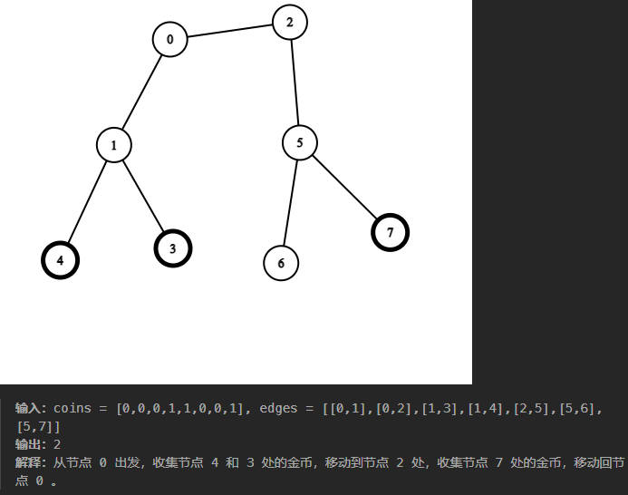

方法一：两次拓扑排序

> 参考题解 https://leetcode.cn/problems/collect-coins-in-a-tree/solutions/2191371/tuo-bu-pai-xu-ji-lu-ru-dui-shi-jian-pyth-6uli/

```c++
int collectTheCoins(vector<int>& coins, vector<vector<int>>& edges) {
    //第1步：建图初始化
    int v_cnt = coins.size();
    vector<vector<int>> graph(v_cnt);
    vector<int> degree(v_cnt, 0);
    for(int i = 0; i < edges.size(); i++){
        int v1 = edges[i][0], v2 = edges[i][1];
        graph[v1].emplace_back(v2);
        graph[v2].emplace_back(v1);
        degree[v1]++;
        degree[v2]++;
    }
    //第2步：第一次拓扑排序（去掉没有金币的子树）
    int ans_cnt = v_cnt - 1;//随着拓扑排序的进行最后剩余的边的数量
    queue<int> que;
    for(int i = 0; i < v_cnt; i++){
        if(degree[i] == 1 && coins[i] == 0){//没有金币的叶子节点
            que.push(i);
        }
    }
    while(!que.empty()){
        ans_cnt--; //删除没有金币的叶子节点，相当于删除与它有关的边
        int v_leaf = que.front();
        que.pop();
        for(auto v_parent : graph[v_leaf]){
            degree[v_parent]--;
            //删除没有金币的叶子节点后，其父节点有可能也成为了没有金币的叶子节点，也需要删除
            if(degree[v_parent] == 1 && coins[v_parent] == 0){
                que.push(v_parent);
            }
        }
    }
    //第3步：第二次拓扑排序（去掉不需要移动到此节点的带有金币节点）
    for(int i = 0; i < v_cnt; i++){
        if(degree[i] == 1 && coins[i] == 1){//有金币的叶子（判断 coins[i] 是避免把没有金币的叶子也算进来）
            que.push(i);
        }
    }
    ans_cnt -= que.size();//删除所有叶子
    while(!que.empty()){
        int v_leaf = que.front();
        que.pop();
        for(auto v_parent : graph[v_leaf]){
            degree[v_parent]--;
            if(degree[v_parent] == 1){
                ans_cnt--;//删除所有叶子的父节点，剩下的ans_cnt就是实际需要走的边
            }
        }
    }
    return max(ans_cnt*2, 0);//每条边都必须走两次
}
```

## [2591 将钱分给最多的儿童 2023.09.22](https://leetcode.cn/problems/distribute-money-to-maximum-children/description/)


方法一：贪心算法+模拟
```c++
int distMoney(int money, int children) {
    //当钱比儿童多时则没有任何分配方案
    if(money < children) {return -1;}
    //当每个儿童都分配8元后还有剩的时候，其中一个儿童把剩下的钱全拿走，这时候他不是恰好8元了
    else if(8 * children < money) {return children - 1;}
    //当前面的儿童都分配到8元，最后一个儿童只能拿到4元时，有一个拿到8元的儿童需要于最后一个儿童分担着4元
    else if(money - 8 * (children-1) == 4) {return children - 2;}
    //其他情况直接计算即可
    else {return (money - children)/7;}
}
```

## [2582 递枕头 2023.09.26](https://leetcode.cn/problems/pass-the-pillow/description/)


方法一：模拟
```c++
int passThePillow(int n, int time) {
    int div = time / (n - 1);
    int sur = time % (n - 1);
    if(div % 2 == 0) {return 1 + sur;}
    else {return n - sur;}
}
```

## [1333 餐厅过滤器 2023.09.27](https://leetcode.cn/problems/filter-restaurants-by-vegan-friendly-price-and-distance/description/)


方法一：数组处理+排序
```c++
vector<int> filterRestaurants(vector<vector<int>>& restaurants, int veganFriendly, int maxPrice, int maxDistance) {
    vector<vector<int>> filter;
    for(int i = 0; i < restaurants.size(); i++){
        if((restaurants[i][2] == 0 && veganFriendly == 1) || restaurants[i][3] > maxPrice || restaurants[i][4] > maxDistance) {continue;}
        vector<int> tmp = {restaurants[i][0], restaurants[i][1]};
        filter.emplace_back(tmp);
    }
    quickSort(filter);
    vector<int> ans;
    for(auto& res : filter){
        ans.emplace_back(res[0]);
    }
    return ans;
}

void qsort(vector<vector<int>>& nums, int l, int r){
    if(l >= r) {return;}
    int i = rand() % (r - l + 1) + l;
    swap(nums[i], nums[r]);
    vector<int> pivot = nums[r];
    i = l - 1;
    for(int j = l; j <= r - 1; j++){
        if((nums[j][1] > pivot[1]) || (nums[j][1] == pivot[1] && nums[j][0] > pivot[0])){
            i++;
            swap(nums[j], nums[i]);
        }
    }
    swap(nums[r], nums[i+1]);
    qsort(nums, l, i);
    qsort(nums, i + 2, r);
}

void quickSort(vector<vector<int>>& nums){
    qsort(nums, 0, nums.size()-1);
}
```
其中快排部分可以用库函数实现，为

```c++
sort(filter.begin(), filter.end(), [](vector<int> &v1, vector<int> &v2) -> bool {
    return v1[1] > v2[1] || (v1[1] == v2[1] && v1[0] > v2[0]);
});
```

在函数判断里，返回true的排在前面，也就是说v1[1]>v2[1]时，返回true，则v1排在v2前面

## [2251 花期内花的数目 2023.09.28](https://leetcode.cn/problems/number-of-flowers-in-full-bloom/description/)


方法一：二分查找


```c++
vector<int> fullBloomFlowers(vector<vector<int>>& flowers, vector<int>& people) {
    vector<int> f_start, f_end, ans;
    for(auto t : flowers){
        f_start.emplace_back(t[0]);
        f_end.emplace_back(t[1]);
    }
    sort(f_start.begin(), f_start.end());
    sort(f_end.begin(), f_end.end());
    for(auto p : people){
        //先求出大于p的下界，减1后就是小于等于p的上界，再加上1就是根据索引求出个数
        int t1 = upper_bound(f_start, p) - 1 + 1;
        //先求出大于等于p的下界，减1后就是小于p的上界，再加上1就是根据索引求出个数
        int t2 = lower_bound(f_end, p) - 1 + 1;
        ans.emplace_back(t1 - t2);
    }
    return ans;
}

int lower_bound(vector<int>& nums, int target){
    int left = 0, right = nums.size();
    while(left < right){
        int mid = (left + right) / 2;
        if(nums[mid] < target) {left = mid + 1;}
        else {right = mid;}
    }
    return left;
}

int upper_bound(vector<int>& nums, int target){
    int left = 0, right = nums.size();
    while(left < right){
        int mid = (left + right) / 2;
        if(nums[mid] <= target) {left = mid + 1;}
        else {right = mid;}
    }
    return left;
}
```

方法二：差分数组 + 离线查询

注意不可以用unordered_map，因为这个数据结构的元素顺序是无序的，顺序会被打乱
```c++
vector<int> fullBloomFlowers(vector<vector<int>>& flowers, vector<int>& people) {
    map<int, int> cnt;
    for(auto f : flowers){
        cnt[f[0]]++;
        cnt[f[1] + 1]--;
    }
    vector<int> indices(people.size());
    iota(indices.begin(), indices.end(), 0);//从0出发依次将++value赋值给相应的元素
    sort(indices.begin(), indices.end(), [&](int a, int b){
        return people[a] < people[b];
    });
    vector<int> ans(people.size());
    int cur = 0;
    auto it = cnt.begin();
    for(int x : indices){
        while(it != cnt.end() && it->first <= people[x]){
            cur += it->second;
            it++;
        }
        ans[x] = cur;
    }
    return ans;
}
```

## [901 股票价格跨度 2023.10.07](https://leetcode.cn/problems/online-stock-span/description/)
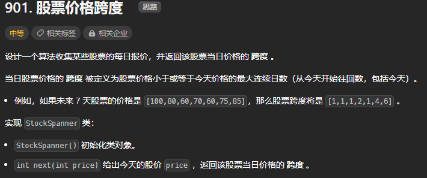

方法一：单调栈
```c++
vector<int> prices;//按顺序存储每天股票的价值
stack<int> st_index;//单调递减栈，存储股票对应的索引

StockSpanner() {
    //建立哨兵
    prices.emplace_back(INT_MAX);
    st_index.push(0);
}

int next(int price) {
    prices.emplace_back(price);
    while(price >= prices[st_index.top()]){
        st_index.pop();
    }
    int ans = (prices.size() - 1) - st_index.top();
    st_index.push(prices.size() - 1);
    return ans;
}
```

## [2034 股票价格波动 2023.10.08](https://leetcode.cn/problems/stock-price-fluctuation/description/)
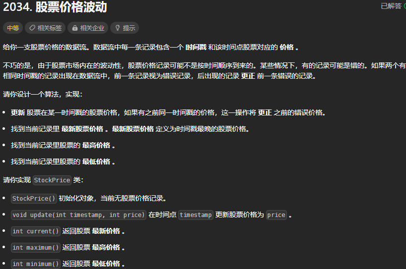

方法一：哈希表+多重有序集合

利用c++库的多重有序集合multiset，与set的唯一区别是multiset可以存储多个相同的值，而set的每个值都具有唯一性。multiset和set的底层实现都是红黑树（特殊的二叉树），且emplace进去后会自动排序，且begin()出来的是最小值，rbegin()出来的是最大值

```c++
class StockPrice {
public:
    StockPrice() {this->current_time = 0;}
    void update(int timestamp, int price) {
        current_time = max(current_time, timestamp);
        int pre_price = time_price.count(timestamp) ? time_price[timestamp] : 0;//查看之前是否有记录
        time_price[timestamp] = price;
        if(pre_price > 0){//若之前存有记录，需把有序集合的对应值删除掉
            auto it = prices.find(pre_price);
            if(it != prices.end()){
                prices.erase(it);
            }
        }
        prices.emplace(price);
    }
    int current() {return time_price[current_time];}
    int maximum() {return *prices.rbegin();}
    int minimum() {return *prices.begin();}
private:
    int current_time;//最新的时间
    unordered_map<int, int> time_price;//存储time与price的哈希表
    multiset<int> prices;//多重有序集合，与set不同的是可以存储多个相同的值
};
```

方法二：哈希表+两个优先队列（最大堆和最小堆）

对于返回股票最高（低）价格操作，每次从最高（低）价格队列的队首元素中得到价格和时间戳，并从哈希表中得到该时间戳对应的实际价格，如果队首元素中的价格和实际价格不一致，则队首元素为过期价格，将队首元素删除，重复该操作直到队首元素不为过期价格，此时返回队首元素中的价格。

```c++
typedef pair<int,int> pii;//自定义数据结构
class StockPrice {
public:
    StockPrice() {this->current_time = 0;}
    void update(int timestamp, int price) {
        current_time = max(current_time, timestamp);
        time_price[timestamp] = price;
        pqMax.emplace(price, timestamp);
        pqMin.emplace(price, timestamp);
    }
    int current() {return time_price[current_time];}
    int maximum() {
        while(1){
            int price = pqMax.top().first, timestamp = pqMax.top().second;
            if(time_price[timestamp] == price) {return price;}
            else {pqMax.pop();}//若队首元素中的价格和实际价格不一致，则队首元素为过期价格，将队首元素删除
        }
    }
    int minimum() {
        while(1){
            int price = pqMin.top().first, timestamp = pqMin.top().second;
            if(time_price[timestamp] == price) {return price;}
            else {pqMin.pop();}//若队首元素中的价格和实际价格不一致，则队首元素为过期价格，将队首元素删除
        }
    }
private:
    int current_time;
    unordered_map<int, int> time_price;
    priority_queue<pii, vector<pii>, less<pii>> pqMax;//大根堆
    priority_queue<pii, vector<pii>, greater<pii>> pqMin;//小根堆
};
```

## [2578 最小和分割 2023.10.09](https://leetcode.cn/problems/split-with-minimum-sum/description/)


方法一：贪心
```c++
int splitNum(int num) {
    vector<int> number;
    while(num != 0){
        number.emplace_back(num % 10);
        num = num / 10;
    }
    sort(number.begin(), number.end());
    int n1 = 0, n2 = 0;
    for(int i = 0; i < number.size(); i = i + 2){
        n1 = n1 * 10 + number[i];
    }
    for(int i = 1; i < number.size(); i = i + 2){//注意这里从1开始
        n2 = n2 * 10 + number[i];
    }
    return n1 + n2;
}
```

## [2731 移动机器人 2023.10.10](https://leetcode.cn/problems/movement-of-robots/description/)


方法一：脑筋急转弯？
* 碰撞是障眼法， 可以看做穿透
* 求模

```c++
int sumDistance(vector<int>& nums, string s, int d) {
    for(int i = 0; i < nums.size(); i++){
        if(s[i] == 'L') {nums[i] -= d;}
        else {nums[i] += d;}
    }
    long sum = 0;
    //单纯地计算时间复杂度是n^2，会超时
    for(int i = 0; i < nums.size()-1; i++){
        for(int j = i+1; j < nums.size(); j++){
            sum += abs(nums[i] - nums[j]);
        }
    }
    int mod = 1e9 + 7;
    return sum % mod;
}
```
* 两两间距离求和， 可以在排序后，看相邻元素的距离被用了几次
* 从小到大枚举 pos[i]，此时左边有 i 个数字，右边有 n−i 个数字（算上 pos[i]），所以共有 i×(n−i) 对数字在计算距离时会累加 pos[i]−pos[i−1]
* 由于用例数值都很大，需要定义long long类型，且每进行一步累加都得取一下模

```c++
int sumDistance(vector<int>& nums, string s, int d) {
    int n = nums.size();
    vector<long long> nums_l(n);
    for(int i = 0; i < n; i++){
        if(s[i] == 'L') {nums_l[i] = (long long)nums[i] - d;}
        else {nums_l[i] = (long long)nums[i] + d;}
    }
    sort(nums_l.begin(), nums_l.end());
    long long sum = 0;
    int mod = 1e9 + 7;
    for(int i = 1; i < n; i++){
        sum += 1ll * (nums_l[i] - nums_l[i-1]) * i % mod * (n - i) % mod;
        sum %= mod;
    }
    return sum;
}
```

## [2512 奖励最顶尖的K名学生 2023.10.11](https://leetcode.cn/problems/reward-top-k-students/description/)


#### 重点字符串匹配算法——[KMP算法](https://leetcode.cn/problems/implement-strstr/solution/duo-tu-yu-jing-xiang-jie-kmp-suan-fa-by-w3c9c/)

寻找字符串中的匹配字符串最先出现的位置
```c++
// KMP字符串匹配算法——haystack为原字符串，needle为匹配串
int KMP_process(string haystack, string needle){
    if(needle.size() == 0) {return 0;}
    vector<int> next(needle.size());//前缀表，存放当前长度下的最长相同前后缀的长度
    //填写前缀表
    for(int left = 0, right = 1; right < needle.size(); right++){
        //当left大于0且与right的字符不相等时，则回退到next数组所指示的位置
        while(left > 0 && needle[right] != needle[left]){
            left = next[left - 1];
        }
        //当right和left的元素相同时，left加一
        if(needle[right] == needle[left]){  
            left++;
        }
        //将left填入到这时right对应的next位置
        next[right] = left;
    }
    //找寻原字符串中匹配串的起始位置
    //j相当于上面的left，并在needle中访问
    //i相当于上面的right，haystack相当于上面的needle，并在haystack中访问，i从0开始而不是从1开始
    for(int j = 0, i = 0; i < haystack.size(); i++){
        while(j > 0 && haystack[i] != needle[j]){
            j = next[j-1];
        }
        if(haystack[i] == needle[j]){
            j++;
        }
        //若j已经在匹配串中走完，则表示匹配完成
        if(j == needle.size()) {return i - needle.size() + 1;}
    }
    return -1;
}
```

寻找字符串中的匹配字符串所有出现的位置
```c++
vector<int> KMP_process_mul(string haystack, string needle){
    vector<int> pos;// 改动的地方
    if(needle.size() == 0) {return pos;}
    vector<int> next(needle.size());
    for(int left = 0, right = 1; right < needle.size(); right++){
        while(left > 0 && needle[right] != needle[left]){
            left = next[left - 1];
        }
        if(needle[right] == needle[left]){
            left++;
        }
        next[right] = left;
    }
    for(int j = 0, i = 0; i < haystack.size(); i++){
        while(j > 0 && haystack[i] != needle[j]){
            j = next[j-1];
        }
        if(haystack[i] == needle[j]){
            j++;
        }
        if(j == needle.size()) {
            pos.emplace_back(i - j + 1);// 改动的地方
            j = next[j - 1];// 改动的地方
        }
    }
    return pos;
}
```

然而.....这题不可以使用KMP，即使是KMP_mul，因为比如poitive词里可能出现了"mh"和"mmh"两种词，由于"mmh"中也包含"mh"，所以也被KMP算法找出来了，就会多算了"mh"的出现次数

方法一：优秀队列+无序集合+字符串流
* 若是不用unordered_set，而是直接用vector进行find，则会超时
* stringstream ss：理解为字符串流。类比输入流，当遇到空格，换行，tab结束一个输入。
* 细节：由于是大根堆，而输出时应id小的优先出队列，所以入队列时id取反

```c++
vector<int> topStudents(vector<string>& positive_feedback, vector<string>& negative_feedback, vector<string>& report, vector<int>& student_id, int k) {
    priority_queue<pair<int, int>, vector<pair<int, int>>> que;
    unordered_set<string> pos{positive_feedback.begin(), positive_feedback.end()};
    unordered_set<string> neg{negative_feedback.begin(), negative_feedback.end()};
    for(int i = 0; i < student_id.size(); i++){
        int score = 0;
        stringstream ss;
        string tmp;
        ss << report[i];
        while(ss >> tmp){
            if(pos.find(tmp) != pos.end()){
                score += 3;
            }
            else if(neg.find(tmp) != neg.end()){
                score -= 1;
            }
        }
        pair<int, int> stu(score, -student_id[i]);
        que.emplace(stu);
    }
    vector<int> ans;
    for(int num = 0; num < k; num++){
        ans.emplace_back(-que.top().second);
        que.pop();
    }
    return ans;
}
```

## [2562 找出数组的串联质 2023.10.12](https://leetcode.cn/problems/find-the-array-concatenation-value/description/)


方法一：直接模拟

```c++
long long findTheArrayConcVal(vector<int>& nums) {
    long long sum = 0;
    for(int left = 0, right = nums.size() - 1; left <= right; left++, right--){
        if(left != right){
            int tmp = nums[right];
            while(tmp != 0){
                tmp /= 10;
                nums[left] *= 10;
            }
            sum += (nums[left] + nums[right]);
            // 或者直接用下面的函数，stoi是将n进制的字符串转化为十进制的函数
            // sum += stoi(to_string(nums[left]) + to_string(nums[right]));
        }
        else{
            sum += nums[left];
        }
    }
    return sum;
}
```

## [93 复原IP地址 2023.10.13（难题）](https://leetcode.cn/problems/restore-ip-addresses/description/)

2023年阿里巴巴面试手撕代码题

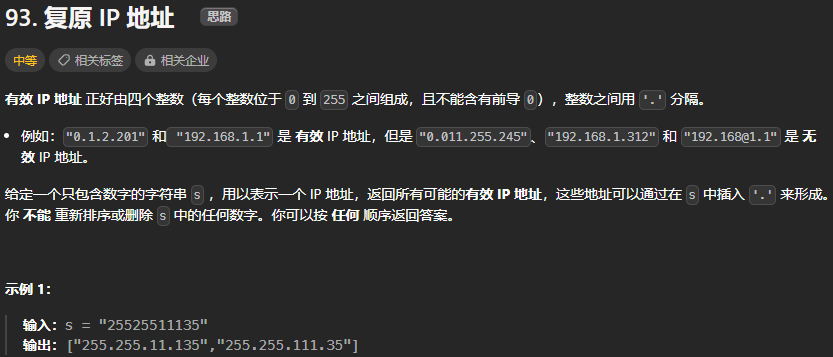

在完成这一题之前先完成[分割回文串](https://leetcode.cn/problems/palindrome-partitioning/description/),复原IP地址这一题实际上就是分割回文串这一题的题解再修改一下判断函数就可以了

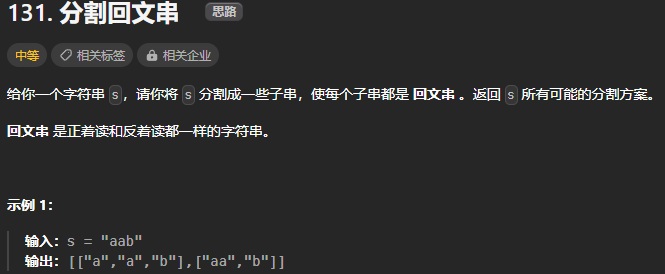

参考题解：https://leetcode.cn/problems/palindrome-partitioning/solutions/54233/hui-su-you-hua-jia-liao-dong-tai-gui-hua-by-liweiw/

方法一：回溯（DFS）

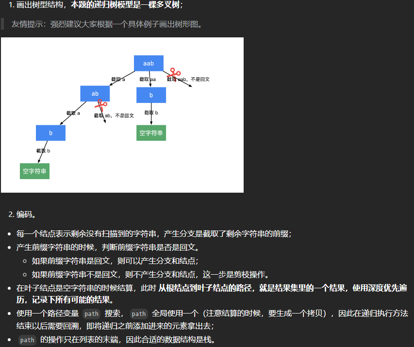

```c++
vector<vector<string>> partition(string s) {
    int len = s.length();
    vector<vector<string>> ans;
    if(len == 0) {return ans;}
    vector<string> path;
    dfs(s, 0, len, path, ans);
    return ans;
}

void dfs(string& s, int index, int len, vector<string>& path, vector<vector<string>>& ans){
    if(index == len){
        ans.emplace_back(path);
        return;
    }
    for(int i = index; i < len; i++){
        if(!check(s, index, i)) {continue;}
        path.emplace_back(s.substr(index, i - index + 1));// 先存这个子串后再回溯，substr函数提出子串
        dfs(s, i + 1, len, path, ans); // 注意这里dfs的起点是i + 1
        path.pop_back();
    }
}

// 判断是否是回文串
bool check(string& s, int left, int right){
    while(left < right){
        if(s[left] != s[right]) {return false;}
        left ++;
        right --;
    }
    return true;
}
```

方法二：回溯（代码随想录版本）

代码随想录参考：https://programmercarl.com/0131.%E5%88%86%E5%89%B2%E5%9B%9E%E6%96%87%E4%B8%B2.html#%E6%80%9D%E8%B7%AF

```c++
class Solution {
private:
    vector<vector<string>> result;
    vector<string> path; // 放已经回文的子串
    void backtracking (const string& s, int startIndex) {
        // 如果起始位置已经大于s的大小，说明已经找到了一组分割方案了
        if (startIndex >= s.size()) {
            result.push_back(path);
            return;
        }
        for (int i = startIndex; i < s.size(); i++) {
            if (isPalindrome(s, startIndex, i)) {   // 是回文子串
                // 获取[startIndex,i]在s中的子串
                string str = s.substr(startIndex, i - startIndex + 1);
                path.push_back(str);
            } else {                                // 不是回文，跳过
                continue;
            }
            backtracking(s, i + 1); // 寻找i+1为起始位置的子串
            path.pop_back(); // 回溯过程，弹出本次已经添加的子串
        }
    }
    bool isPalindrome(const string& s, int start, int end) {
        for (int i = start, j = end; i < j; i++, j--) {
            if (s[i] != s[j]) {
                return false;
            }
        }
        return true;
    }
public:
    vector<vector<string>> partition(string s) {
        result.clear();
        path.clear();
        backtracking(s, 0);
        return result;
    }
};
```

现在看回原题

代码随想录参考：https://leetcode.cn/problems/restore-ip-addresses/solutions/850482/dai-ma-sui-xiang-lu-93-fu-yuan-ip-di-zhi-pzjo/
```c++
class Solution {
private:
    vector<string> result;// 记录结果
    // startIndex: 搜索的起始位置，pointNum:添加逗点的数量
    void backtracking(string& s, int startIndex, int pointNum) {
        if (pointNum == 3) { // 逗点数量为3时，分隔结束
            // 判断第四段子字符串是否合法，如果合法就放进result中
            if (isValid(s, startIndex, s.size() - 1)) {
                result.push_back(s);
            }
            return;
        }
        for (int i = startIndex; i < s.size(); i++) {
            if (isValid(s, startIndex, i)) { // 判断 [startIndex,i] 这个区间的子串是否合法
                s.insert(s.begin() + i + 1 , '.');  // 在i的后面插入一个逗点
                pointNum++;
                backtracking(s, i + 2, pointNum);   // 插入逗点之后下一个子串的起始位置为i+2
                pointNum--;                         // 回溯
                s.erase(s.begin() + i + 1);         // 回溯删掉逗点
            } else break; // 不合法，直接结束本层循环
        }
    }
    // 判断字符串s在左闭又闭区间[start, end]所组成的数字是否合法
    bool isValid(const string& s, int start, int end) {
        if (start > end) {
            return false;
        }
        if (s[start] == '0' && start != end) { // 0开头的数字不合法
                return false;
        }
        int num = 0;
        for (int i = start; i <= end; i++) {
            if (s[i] > '9' || s[i] < '0') { // 遇到非数字字符不合法
                return false;
            }
            num = num * 10 + (s[i] - '0');
            if (num > 255) { // 如果大于255了不合法
                return false;
            }
        }
        return true;
    }
public:
    vector<string> restoreIpAddresses(string s) {
        result.clear();
        if (s.size() < 4 || s.size() > 12) return result; // 算是剪枝了
        backtracking(s, 0, 0);
        return result;
    }
};
```

## [136 只出现一次的数字 2023.10.14](https://leetcode.cn/problems/single-number/description/)

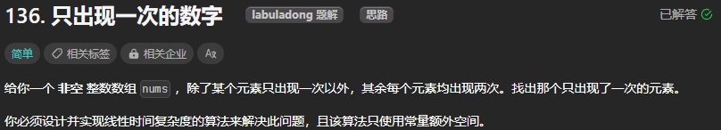

方法一：位运算，使用异或

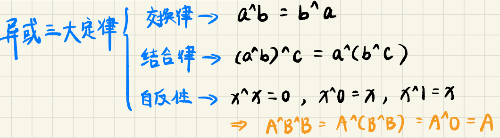

```c++
int singleNumber(vector<int>& nums) {
    int ans = 0;
    for(auto& n : nums){
        ans ^= n;
    }
    return ans;
}
```

## [137 只出现一次的数字II 2023.10.15](https://leetcode.cn/problems/single-number-ii/description/)

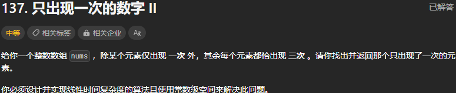

方法一：位运算，使用异或

```c++
int singleNumber(vector<int>& nums) {
    vector<int> cnts(32, 0);
    for(int& n : nums){
        for(int i = 0; i < 32; i++){
            cnts[i] += (n >> i) & 1;
        }
    }
    int ans = 0;
    for(int i = 0; i < 32; i++){
        if(cnts[i] % 3 != 0){
            ans |= 1 << i;
        }
    }
    return ans;
}
```

## [260 只出现一次的数字III 2023.10.16](https://leetcode.cn/problems/single-number-iii/description/)

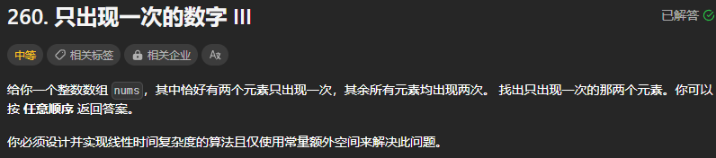

方法一：位运算，使用异或

```c++
vector<int> singleNumber(vector<int>& nums) {
    int n = 0;
    for(auto& i : nums) {n = n ^ i;}
    int index = 1;
    while((n & index) == 0){// 由低位到高位找到两个元素第一个不相等的位
        index <<= 1;
    }
    vector<int> ans = {0, 0};
    for(auto& i : nums){
        if(i & index) {ans[0] ^= i;}
        else {ans[1] ^= i;}
    }
    return ans;
}
```

## [2652 倍数求和 2023.10.17](https://leetcode.cn/problems/sum-multiples/description/)

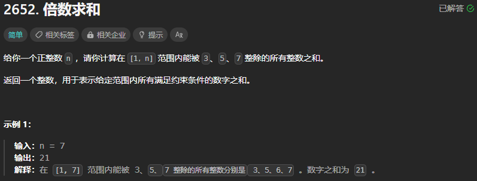

方法一：直接模拟
```c++
int sumOfMultiples(int n) {
    int ans = 0;
    for(int i = 1; i <= n; i++){
        if(i % 3 == 0 || i % 5 == 0 || i % 7 == 0){
            ans += i;
        }
    }
    return ans;
}
```
方法二：容斥定理

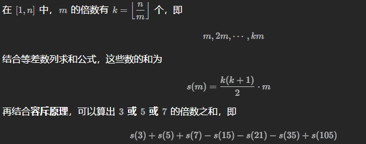
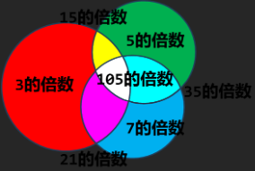

```c++
class Solution {
public:
    int sumOfMultiples(int n) {
        num = n;
        return cal(3) + cal(5) + cal(7) - cal(3*5) - cal(3*7) - cal(5*7) + cal(3*5*7);
    }
    int cal(int s){
        int k = num / s;
        return k * (k + 1) * s / 2;
    }
private:
    int num;
};
```

## [2530 执行K次操作后的最大分数 2023.10.18](https://leetcode.cn/problems/maximal-score-after-applying-k-operations/description/)

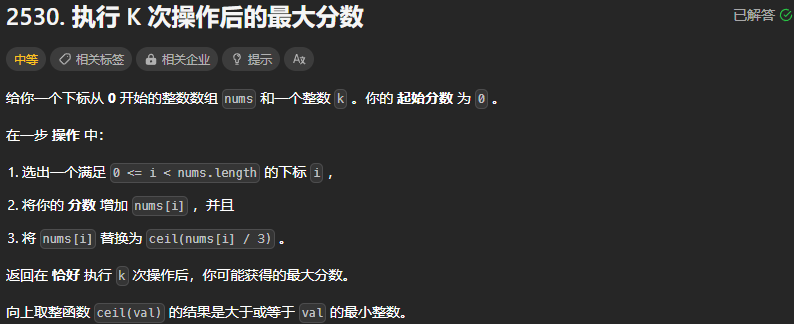

方法一：优先队列（大根堆）

```c++
long long maxKelements(vector<int>& nums, int k) {
    long long ans = 0;
    priority_queue<int, vector<int>> que;// 大根堆
    for(auto n : nums){
        que.emplace(n);
    }
    for(int i = 0; i < k; i++){
        int tmp = que.top();
        que.pop();
        ans += tmp;
        que.emplace((tmp + 2)/3);// 向上取整，不懂为什么ceil函数也是向下取整
    }
    return ans;
}
```

## [1726 同积元组 2023.10.19](https://leetcode.cn/problems/tuple-with-same-product/description/)

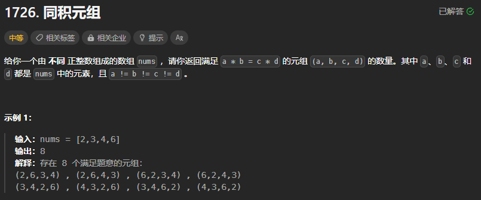

方法一：哈希表

```c++
int tupleSameProduct(vector<int>& nums) {
    unordered_map<int, int> hash;
    for(int i = 0; i < nums.size()-1; i++){
        for(int j = i+1; j < nums.size(); j++){
            int cal = nums[i] * nums[j];
            hash[cal] ++;
        }
    }
    int ans = 0;
    for(auto &h : hash){
        ans += (h.second * (h.second - 1) / 2 * 8);// 记住要乘上8，一个组合可以产生元素排序不同的8种元组
    }
    return ans;
}
```
