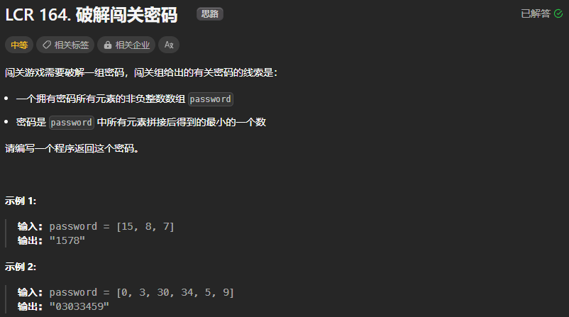
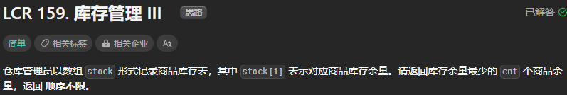
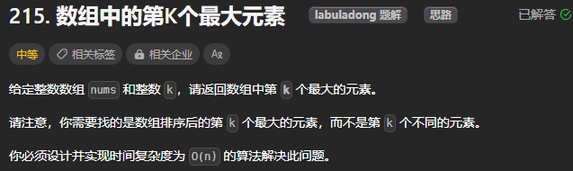

# Leetcode Notes

## 一、排序算法

[刷题指南](https://leetcode.cn/circle/discuss/KIfqN3/)

---

### 十大排序算法（升序）

重要算法：快速排序、归并排序、堆排序


可以使用[这题](https://leetcode.cn/problems/sort-an-array/description/)练习一下基础的排序算法

#### (1) 快速排序（重点）

分治的思想，递归地随机选择主元，然后将主元放在正确的位置


```c++
// 快速排序
void qSort(vector<int>& nums, int l, int r){
    if(l >= r) {return;}
    int i = rand() % (r - l + 1) + l;//随机选择主元
    swap(nums[r], nums[i]);
    int pivot = nums[r];
    i = l - 1;
    for(int j = l; j <= r - 1; j++){
        if(nums[j] <= pivot){
            i++;
            swap(nums[j], nums[i]);
        }
    }
    swap(nums[i + 1], nums[r]);// i+1是主元应摆放的位置
    qSort(nums, l, i);
    qSort(nums, i + 2, r);
}

vector<int> quickSort(vector<int>& nums){
    qSort(nums, 0, nums.size()-1);
    return nums;
}
```

#### (2) 归并排序（重点）
分治的思想，最适用于**外部排序**


```c++
void mSort(vector<int>& nums, int l, int r){
    if(l >= r) {return;}
    int mid = (l + r) / 2;
    mSort(nums, l, mid);
    mSort(nums, mid + 1, r);
    vector<int> res;//暂时存储有序数组
    int i = l, j = mid + 1;
    while(i <= mid && j <= r){
        if(nums[i] <= nums[j]) {res.emplace_back(nums[i]); i++;}
        else {res.emplace_back(nums[j]); j++;}
    }
    while(i <= mid) {res.emplace_back(nums[i]); i++;}
    while(j <= r) {res.emplace_back(nums[j]); j++;}
    for(int i = 0; i < r - l + 1; i ++){
        nums[i + l] = res[i];
    }
}

vector<int> mergeSort(vector<int>& nums){
    mSort(nums, 0, nums.size()-1);
    return nums;
}
```

#### (3) 堆排序（重点）


```c++
//以cur节点为出发点，调整cur及其以下的节点，以满足父节点大于其子节点
void adjust(vector<int>& nums, int cur, int len){
    while(2 * cur + 1 < len){//节点cur的左节点不超过len
        int c_left = 2 * cur + 1;//左子节点
        int c_right = 2 * cur + 2;//右子节点
        // 当右子节点存在且大于左子节点时，则右子节点为c_large，否则左子节点为c_large
        int c_large = (c_right < len && nums[c_right] > nums[c_left]) ? c_right : c_left;
        // 当父节点比c_large小时，c_large将成为父节点
        if(nums[c_large] > nums[cur]){
            swap(nums[c_large], nums[cur]); 
            cur = c_large;
        }
        else {break;}//若父节点仍然大于其子节点， 则退出循环
    }
}

vector<int> heapSort(vector<int>& nums){
    int n = nums.size();
    for(int i = n/2 - 1; i >= 0; i--){//从⼦节点是叶⼦节点的⽗节点开始向下调整，确保父节点一定大于其子节点
        adjust(nums, i, n);
    }
    for(int i = n - 1; i > 0; i--){//将堆顶节点挪到最末尾位置，然后选出新的堆顶
        swap(nums[0], nums[i]);
        adjust(nums, 0, i);//新的堆顶向下沉
    }
    return nums;
}
```

#### (4) 选择排序（了解）

每次从后面的未排序部分选出最小的数挪到前面的排序部分中的尾部

数组形式
```c++
vector<int> selectSort(vector<int>& nums){
    int n = nums.size();
    for(int i = 0; i < n - 1; i++){
        int min = i;
        for(int j = i + 1; j < n; j++){
            if(nums[j] < nums[min]) {min = j;}
        }
        swap(nums[i], nums[min]);
    }
    return nums;
}
```
单向链表形式
```c++
ListNode* selectSort(ListNode* head){
    ListNode* slow;
    ListNode* fast;
    for(slow = head; slow != nullptr; slow = slow->next){
        for(fast = slow->next; fast != nullptr; fast = fast->next){
            if(slow->val > fast->val){
                int tmp = slow->val;
                slow->val = fast->val;
                fast->val = tmp;
            }
        }
    }
    return head;
}
```
#### (5) 冒泡排序（了解）
```c++
vector<int> bubbleSort(vector<int>& nums){
    int n = nums.size();
    for(int i = 0; i < n - 1; i++){
        for(int j = 0; j < n - i - 1; j++){
            if(nums[j] > nums[j+1]){
                swap(nums[j], nums[j+1]);
            }
        }
    }
}
```

#### (6) 插入排序（熟悉）

每次把后面的未排序部分中的数按顺序挪到前面的排序部分中的合适位置

数组形式
```c++
vector<int> insertSort(vector<int>& nums){
    int n = nums.size();
    for(int i = 1; i < n; i++){
        int tmp = nums[i];
        int j = i;
        while(j > 0 && nums[j - 1] > tmp){
            nums[j] = nums[j - 1];
            j --;
        }
        nums[j] = tmp;
    }
    return nums;
}
```

单向链表形式
```c++
ListNode* insertSort(ListNode* head){
    if(head == nullptr) {return head;}
    ListNode* dummy = new ListNode();
    dummy->next = head;
    ListNode* pre = dummy, *cur = head->next, *final = head;
    while(final->next != nullptr){
        if(final->val <= cur->val){
            final = final->next;
        }
        else{
            pre = dummy;
            while(cur->val > pre->next->val){
                pre = pre->next;
            }
            final->next = cur->next;
            cur->next = pre->next;
            pre->next = cur;
        }
        cur = final->next;
    }
    return dummy->next;
}
```

#### (7) 希尔排序（了解）


```c++
vector<int> shellSort(vector<int>& nums){
    int n = nums.size();
    int gap = 1;
    while(gap < n / 3) {gap = gap * 3 + 1;}
    while(gap > 0){
        for(int i = gap; i < n; i++){
            int tmp = nums[i];
            int j = i;
            while(j >= gap && nums[j - gap] > tmp){
                nums[j] = nums[j - gap];
                j -= gap;
            }
            nums[j] = tmp;
        }
        gap = gap / 3;
    }
    return nums;
}
```

#### (8) 计数排序（了解）


```c++
vector<int> countingSort(vector<int>& nums){
    int n = nums.size();
    if(n == 0) {return nums;}
    int min_ele = *min_element(nums.begin(), nums.end());
    int max_ele = *max_element(nums.begin(), nums.end());
    vector<int> count_nums(max_ele - min_ele + 1, 0);
    for(auto num : nums){
        count_nums[num - min_ele] ++;
    }
    int j = 0;
    for(int i = 0; i < n; i++){
        while(count_nums[j] == 0) {j ++;}
        nums[i] = j + min_ele;
        count_nums[j] --;
    }
    return nums;
}
```

#### (9) 桶排序（了解）

相当于将数组分为若干份，每一份放进一个桶里进行内部的排序，后将桶中的数组合并在一起即可

```c++
vector<int> bucketSort(vector<int>& nums, int bucket_size){
    int n = nums.size();
    if(n == 0) {return nums;}
    int min_ele = *min_element(nums.begin(), nums.end());
    int max_ele = *max_element(nums.begin(), nums.end());
    int bucket_num = (max_ele - min_ele) / bucket_size + 1;
    vector<vector<int>> bucket(bucket_num);
    for(int i = 0; i < n; i++){
        bucket[(nums[i] - min_ele) / bucket_size].emplace_back(nums[i]);
    }
    int i = 0;
    for(int j = 0; j < bucket_num; j++){
        int size = bucket[j].size();
        bucket[j] = quickSort(bucket[j]);// 每个桶里面借助其他排序算法进行排序，在这里使用了快排
        for(auto b : bucket[j]){
            nums[i] = b;
            i++;
        }
    }
    return nums;
}
```

####(10) 基数排序（不用学习）

由于基数排序只能用在非负数数组的排序，局限性很大，故一般不使用

### 快速排序习题

#### （1）[LCR164 破解闯关密码](https://leetcode.cn/problems/ba-shu-zu-pai-cheng-zui-xiao-de-shu-lcof/description/)



更改比较大小规则，且使用字符串大小比较特性：

* 若拼接字符串$x+y>y+x$，则x大于y
* 若拼接字符串$x+y<y+x$，则x小于y
* 如"303"<"330"，则"3"要排在"30"的后面

to_string()函数：将数字常量转换为字符串

```c++
string crackPassword(vector<int>& password) {
    quickSort(password);
    string ans = "";
    for(int i = 0; i < password.size(); i++){
        ans += to_string(password[i]);
    }
    return ans;
}

void qSort(vector<int>& nums, int l, int r){
    if(l >= r) {return;}
    int mid = rand() % (r - l + 1) + l;
    string pivot = to_string(nums[mid]);
    swap(nums[mid], nums[r]);
    int i = l - 1;
    for(int j = l; j <= r - 1; j++){
        string tmp = to_string(nums[j]);
        if(pivot + tmp > tmp + pivot){
            i++;
            swap(nums[j], nums[i]);
        }
    }
    swap(nums[i+1], nums[r]);
    qSort(nums, l, i);
    qSort(nums, i+2, r);
}

void quickSort(vector<int>& nums){
    qSort(nums, 0, nums.size() - 1);
}
```

#### （2）[LCR 159. 库存管理 III](https://leetcode.cn/problems/zui-xiao-de-kge-shu-lcof/description/)



```c++
vector<int> inventoryManagement(vector<int>& stock, int cnt) {
    quickSort(stock);
    vector<int> ans;
    for(int i = 0; i < cnt; i++){
        ans.emplace_back(stock[i]);
    }
    return ans;
}
```

#### （3）[215. 数组中的第K个最大元素](https://leetcode.cn/problems/kth-largest-element-in-an-array/description/)



方法一：直接排序后返回，但超时了

```c++
int findKthLargest(vector<int>& nums, int k) {
    quickSort(nums);// 注意这里是降序排列
    return nums[k-1];
}
```

方法二：仍然是快速排序，但每次只考虑第K个元素所在的子数组，也仍然会超时

```c++
int findKthLargest(vector<int>& nums, int k) {
    return quickSort(nums, k-1);// 降序排列，k-1是第k个最大元素的索引值
}

int qSort(vector<int>& nums, int l, int r, int k){
    if(l >= r) {return nums[k];}
    int i = rand() % (r-l+1) + l;
    swap(nums[i], nums[r]);
    i = l - 1;
    for(int j = l; j <= r-1; j++){
        if(nums[j] > nums[r]){
            i++;
            swap(nums[j], nums[i]);
        }
    }
    swap(nums[i+1], nums[r]);
    // 只考虑包含有第k个最大元素的那一部分，另一部分可以不排序，减少运行时间
    if(k < i+1) {return qSort(nums, l, i, k);}
    else if(k > i+1) {return qSort(nums, i+2, r, k);}
    else {return nums[k];}
}

int quickSort(vector<int>& nums, int k){
    return qSort(nums, 0, nums.size()-1, k);
}
```

方法三：堆排序，弹出第K个元素后就可结束进程，不超时了

```c++
int findKthLargest(vector<int>& nums, int k) {
    return heapSort(nums, k);
}

int heapSort(vector<int>& nums, int k){
    int n = nums.size();
    for(int i = n/2 -1; i >= 0; i--){
        adjust(nums, i, n);
    }
    // 将前面k-1个最大的元素放到堆底，那么第k个最大元素此时再堆顶
    for(int i = n - 1; i >= n - k + 1; i--){
        swap(nums[0], nums[i]);
        adjust(nums, 0, i);
    }
    return nums[0];
}
```